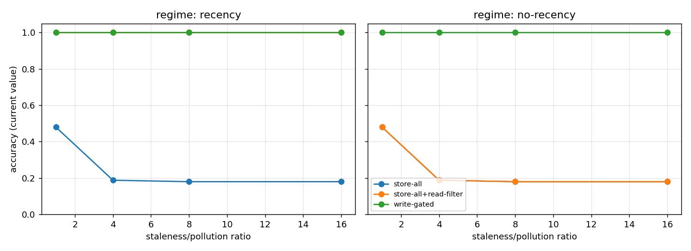

# write-path suite

>  **Status: frozen at v0. This is a constructed intuition pump, not evidence.** It is
>  published inside the [Provenance Principle](../../README.md) canon as an illustration
>  only — do not cite its numbers as findings. Its design favors the hypothesis on three
>  counts, disclosed on purpose (see DESIGN.md): the generator saturates above ~5 stale
>  values so ratios 8/16 are not real; the no-recency read-filter baseline equals store-all
>  by construction; the write-gated arm uses near-oracular structured provenance. For the
>  strong write-vs-read claim with real evaluation, see Selective Memory (arXiv:2603.15994).


A small synthetic setup that makes one mechanism executable: whether good retrieval can
rescue a carelessly filled store depends on one specific signal being present. Under this
toy's assumptions, that signal is provenance.

Everything here is deterministic. No model downloads, no API keys, no GPU. NumPy for
the core, matplotlib only if you want the plot.

```bash
pip install -r requirements.txt
python run.py          # prints the table, writes results.json
python run.py --plot   # also writes curve.png
pytest -q
```

Runs in a few seconds.

## What I measured

A store fills up with facts. Some of those facts get updated over time, so the old
value goes stale but stays in the store anyway. That is what happens when nothing
curates the writes. Then I ask for the current value of each field and count how
often the answer is right.

Three setups. Same retriever, same reader, same amount of context handed to the
reader (`top-k`). The only thing that changes is where curation happens:

- A, store-all: keep everything, retrieve top-k, answer from it.
- B, store-all + read filter: keep everything, but at query time pull a wider pool,
  drop near-duplicates, prefer the most recent, then cut down to k.
- C, write-gated: when a newer value arrives, drop the stale one, then retrieve top-k.

The budget is matched on purpose. C is not allowed to win by handing the reader
fewer and cleaner facts. All three feed the reader the same number of items.

## Result

Percentage answered with the current value, averaged over 5 seeds, `k=5`. The
`ratio` column is how many stale copies pile up per fact.

```
read path HAS write order (recency)
 ratio   A store-all   B read-filter   C write-gated
     1          0.48            1.00            1.00
     4          0.19            1.00            1.00
     8          0.18            1.00            1.00
    16          0.18            1.00            1.00

read path does NOT have write order
 ratio   A store-all   B read-filter   C write-gated
     1          0.48            0.48            1.00
     4          0.19            0.19            1.00
     8          0.18            0.18            1.00
    16          0.18            0.18            1.00
```



Two regimes, and they say different things.

When the read filter can see write order, it recovers everything. B ties C at 100%.
If I had shipped a flat "writing matters more than retrieval" claim, this column
alone would have sunk it.

Take that signal away, which is the normal situation for stores that just append
facts, and the read filter falls to the store-all floor (about 18% at 16:1) while
the gated store stays at 100%.

The reason is simple once you see it. A current fact and a stale one about the same
field look almost the same to a retriever. Same entity, same field name, only the
value differs, and the query never mentions the value. So similarity cannot tell them
apart. Recency can, if you kept it. If you didn't, the read side has nothing to work
with, and the only place left to fix the problem is the write.

## So what

The usual instinct with agent memory is to spend the budget on retrieval: better
rerankers, hybrid search, query expansion. This says the ceiling on that work is set
earlier than people think. If the store appends without tracking which fact replaced
which, retrieval cannot reconstruct that later, and the answer drifts to whatever
stale copy happens to rank first. Stamping provenance at write time, or curating
then, costs less than any read-side machinery, and it is the step most stores skip.

## Limitations

Worth reading before quoting any number.

- The corpus is synthetic. Template facts, template distractors. That buys control
  and a clean repro; it does not prove the effect size survives on real text. A
  LongMemEval slice is the obvious next step.
- The reader is rule-based, not an LLM. It pulls the field value straight out of the
  retrieved facts. That keeps the measurement free and repeatable. An LLM reader adds
  cost and variance, not rigor.
- One write policy only: keep the latest value per field. No merge, no handling of an
  update that contradicts without restating, no eviction under a size cap.
- The provenance gap is a modelling choice and I am stating it on purpose. Arm C uses
  the update event's recency; arm B only gets it in the first regime. That matches
  production, where the write path sees the update happen and the read path has to
  guess from stored text. The experiment measures what that gap costs. It does not
  bake in the answer.

This is a regression probe, not a benchmark, and not a claim that any specific
framework is broken.

## Files

```
writepath.py       corpus generator, retriever, the three arms, reader, experiment
run.py             CLI: table, results.json, optional curve.png
test_writepath.py  deterministic tests
requirements.txt   pinned
DESIGN.md          the design and the conditions under which the claim fails
```

This is one piece of a longer line of work on the memory lifecycle: how facts get
written, how they go stale, and whether they ever really get deleted. This one is
about the writing.
